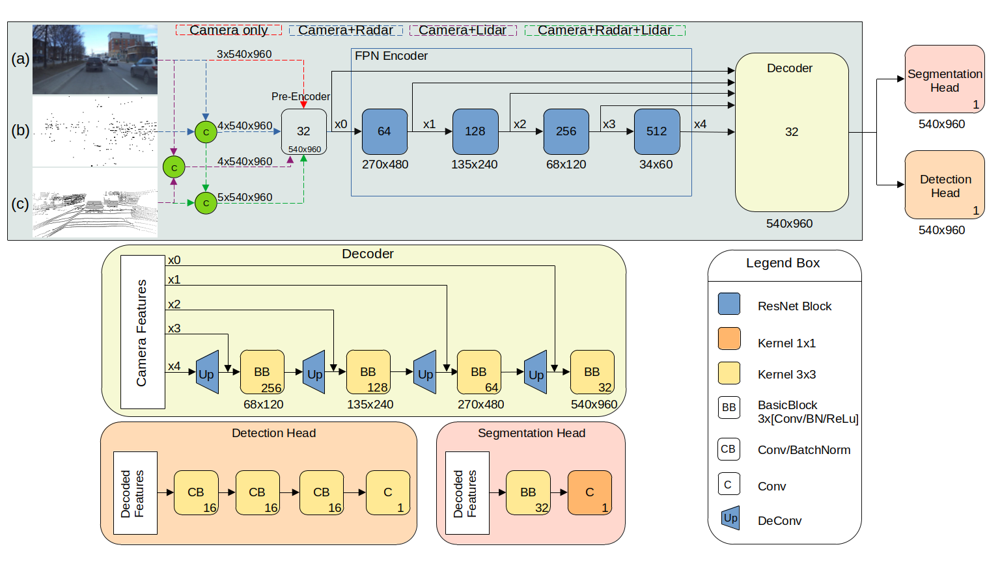

# Single and Multi-Task Learning Through Multi-Modal Sensor Fusion

<p align="center">
  
</p> 

## Abstract
Cameras offer high-resolution visual data, but face limitations in low light conditions and adverse weather. High Definition (HD) imaging Radar data are not only more reliable under adverse conditions, but also offer higher angular resolution with limited recognition of visual features. On the other hand despite being expensive, lidar provide high-precision distance measurements and denser 3D point clouds. Since each sensor presents trade-offs, careful consideration in developing an effective sensor fusion algorithm for automotive applications is needed. Hence the challenge lies in optimally finding the right sensor combination and the fusion point where the accuracy and computational complexity parameters are unbiased. In this work, the proposed fusion architectures intake camera images and the point cloud data from HD radar and lidar sensor in perspective view, conducting early, mid, and late-level fusion. The proposed camera-radar, camera-lidar, and camera-radar-lidar fusion models are trained to detect vehicles and segment free drivable space simultaneously and separately. Experiments are conducted on the latest RADIal data set where we show that integrating radar data with camera closely matches the performance achieved by utilizing lidar, and it outperforms the performances the most recent standalone and fusion models. 


## Fusion Architecture
<p align="center">
  
</p>

The models are trained and tested on the [RADIal dataset](https://github.com/valeoai/RADIal/tree/main). The dataset can be downloaded
[here](https://github.com/valeoai/RADIal/tree/main#labels:~:text=Download%20instructions). We are primarily using camera images, radar and lidar point cloud data for our experiments. For object detection, we use the labels provided, but for free space segmentation the labels are converted to the perspective view as they provide labels in polar domain.

## Setting up the virtual environment
0. Clone the repo and set up the conda environment:
```bash
$ git clone "this repo"
$ conda create --prefix "your_path" python=3.9 -y
$ conda update -n base -c defaults conda
$ source activate "your_path"
```

1. The following are the packages used:
```bash
$ conda install pytorch==1.12.1 torchvision==0.13.1 torchaudio==0.12.1 cudatoolkit=11.3 -c pytorch
$ pip install -U pip
$ pip3 install pkbar
$ pip3 install tensorboard
$ pip3 install pandas
$ pip3 install shapely
```
## Running the code

### Training
To train a model, a JSON configuration file should be set. 
The configuration file is provided here: `config/config_allmodality.json`

All pretrained models with config file for camera, camera-radar, camera-lidar and camera-radar-lidar are place here: [Download](https://drive.google.com/drive/folders/1LWGNDl83KXffw0y70bqBalbg2APYaLhC?usp=drive_link)

Please run the following to train the model. Camera-Radar-Lidar early fusion for object detection will be chosen by default. Make sure to prepare the data and set the `config/config_allmodality.json` file appropriately to train any multi-tasking fusion model in perspective view. Our code also provides Bird's Eye View fusion architectures, which is not in scope for this research. 
```bash
$ python 1-Train.py
```
### Evaluation
To evaluate the model performance, please load the trained model and run:
```bash
$ python 2-Evaluation.py
```
### Testing
To obtain qualitative results, please load the trained model and run:
```bash
$ python 3-Test.py
```
### Computational complexity
To compute Frames Per Second (FPS), please load the trained model and run:
```bash
$ python 4-FPS.py
```
## Acknowledgments
Thanks to Eindhoven University of Technology and Elektrobit Automotive GmbH for their continous support.

## License
The repo is released under the BSD 3-Clause License.
Patent status: "patent applied for".
